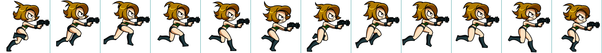

# Client documentation

## SDLSession

This class is a simple wrapper for SDL and SDL_image initialization.
Just create an instance at the start of the program and it will take care of itself.

## Window

This class is a simple wrapper for SDL_Window and SDL_Render.
The constructor takes a title, a screen resolution and some SDL flags (usually just SDL_WINDOW_SHOWN).
To use it, just create an instance of this class, make sure to have a Sprite or AnimatedSprite to draw something to the
Window, and then just call `.clear()` before drawing and `.render()` after doing so.

## Sprite

This is a wrapper to draw static sprites on a Window.
The constructor takes a file path for the image, and a Window object.
To use it, just call `.draw()` with the corresponding Window, and then you have two options:
* We can pass `x, y` coordinates corresponding to where we want to render the whole texture on the Window.
* Or we can pass a `SDL_Rect` to specify to which area of the Window we want to render the whole texture, this method will
stretch or shrink the texture to fit the area of the rectangle.

## AnimatedSprite

This is a wrapper to draw animated sprites.
It works pretty much the same way Sprite does, but it doesn't take a `SDL_Rect` pointer for now. After each call to `.draw()`
make sure to call `.updateFrameStep()` to advance to the next sprite in the animation.

## Animated sprites format

Every sprite sheet for every single animation in the game consists of N frames and N borders of 1px each between them.
For example, take:

 

 We can see there's no border to the left of the first frame, and then we have
a 1px border between each frame, and another one after the last frame of the sheet.
It's important to comply with this format for now, since I don't think we have the time to properly edit every single sprite sheet
to have no borders between frames (or before/after the first/last one).
